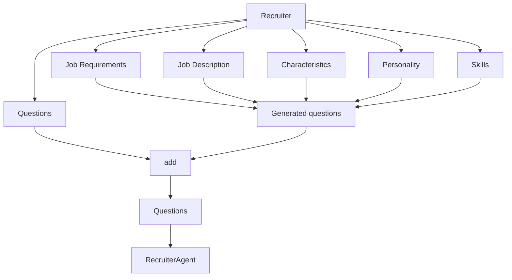
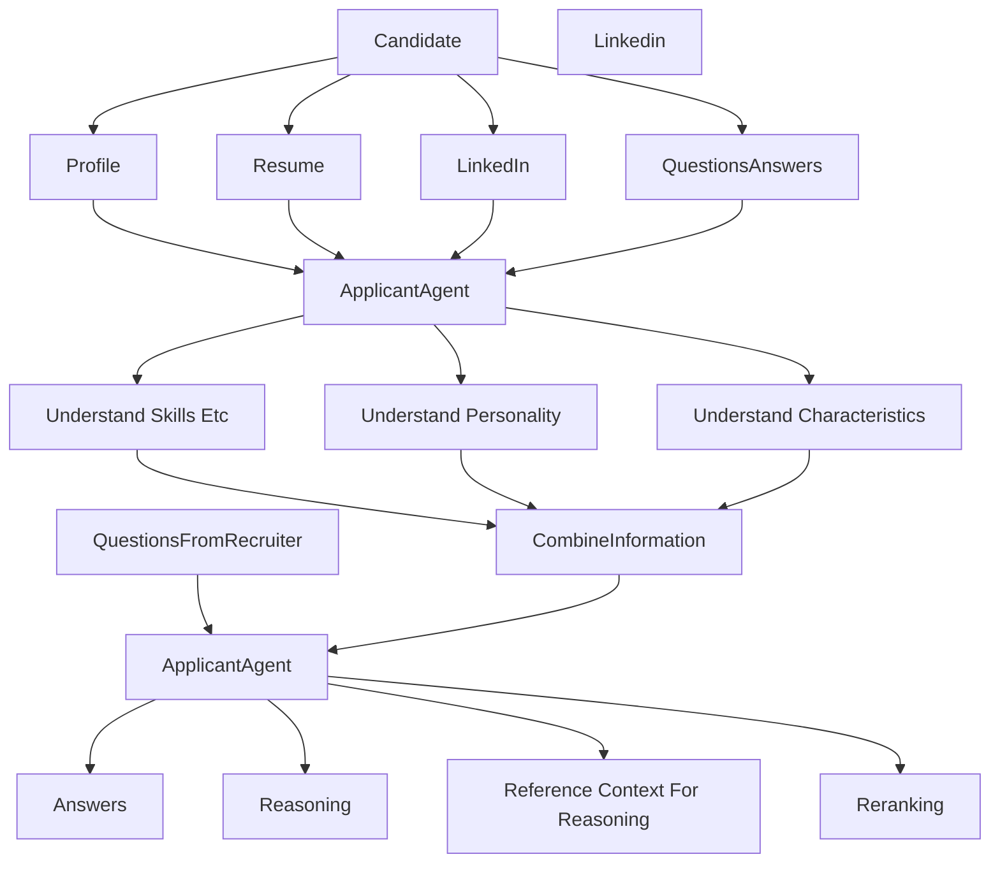

# Recruit AI Agentic Platform

-------

The workflow

A. Recruiter workflow

B. Candidate workflow

-------

Screenshots:

#### A. Recruiters

1. Recruiter Dashboard

----------

2. Candidate Evaluation

-------

3. Candidate Comparison

-------

#### B. Candidates

1. Candidate Dashboard

---------

2. Candidate Profile

-------

3. Interview Process

   

