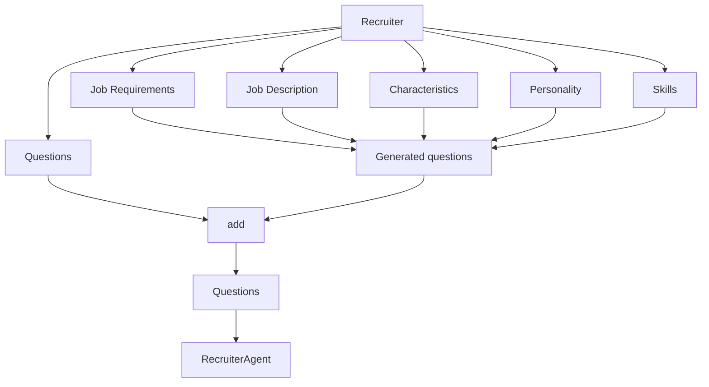
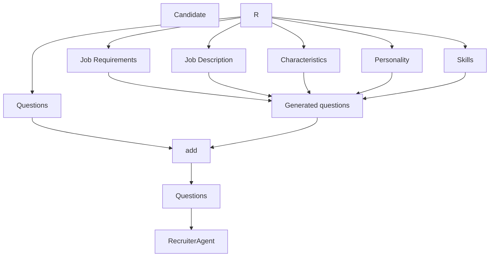

# recruiter-ai-agent-aiiffo-hackathon

The workflow

Recruiter workflow

- The recruiter will upload the job description.
- The recruiter will also add some questions.
- The recruiter 

```mermaid

graph TD
    R[Recruiter] 
    JD[Job Description]
    QR[Questions]
    Req[Job Requirements]
    GQ[Generated questions]
    Characteristics
    Personality
    Skills
    R --> JD
    R --> QR
    R --> Req
    Req --> GQ
    JD --> GQ
    plus[add]
    QR --> plus
    GQ --> plus
    R --> Characteristics --> GQ
    R --> Personality --> GQ
    R --> Skills --> GQ
    plus --> Questions
    Questions --> RecruiterAgent

```

```mermaid

graph TD
    C[Candidate] 
    JD[Job Description]
    QR[Questions]
    Req[Job Requirements]
    GQ[Generated questions]
    Characteristics
    Personality
    Skills
    R --> JD
    R --> QR
    R --> Req
    Req --> GQ
    JD --> GQ
    plus[add]
    QR --> plus
    GQ --> plus
    R --> Characteristics --> GQ
    R --> Personality --> GQ
    R --> Skills --> GQ
    plus --> Questions
    Questions --> RecruiterAgent

```

