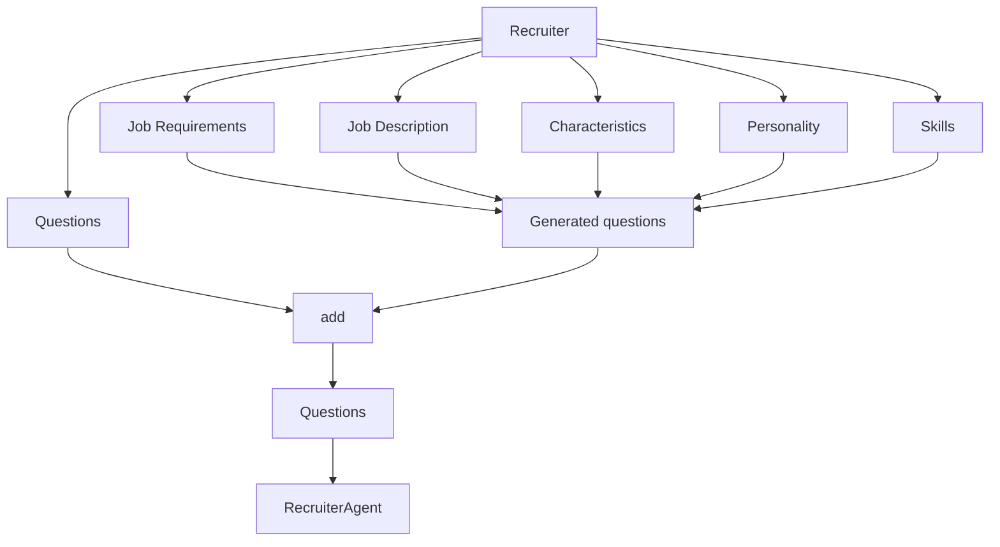
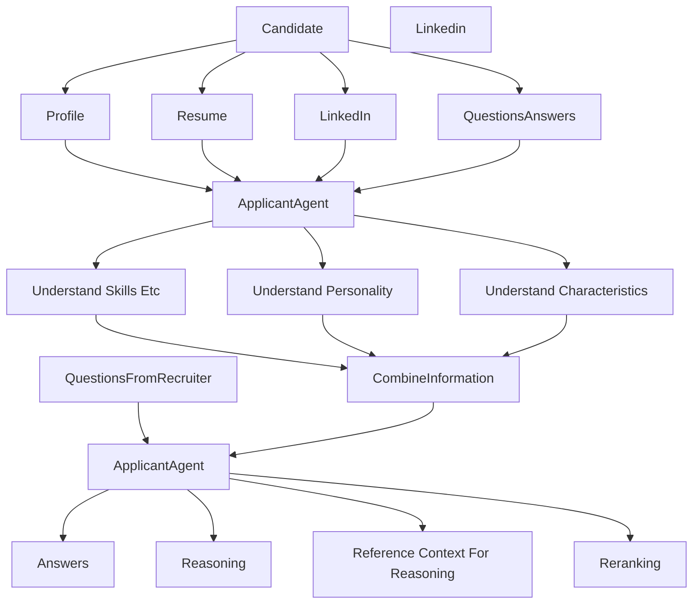

# recruiter-ai-agent-ted-ai-hackathon

The workflow

Recruiter workflow

- The recruiter will upload the job description.
- The recruiter will also add some questions.
- The recruiter 

```mermaid

graph TD
    R[Recruiter] 
    JD[Job Description]
    QR[Questions]
    Req[Job Requirements]
    GQ[Generated questions]
    Characteristics
    Personality
    Skills
    R --> JD
    R --> QR
    R --> Req
    Req --> GQ
    JD --> GQ
    plus[add]
    QR --> plus
    GQ --> plus
    R --> Characteristics --> GQ
    R --> Personality --> GQ
    R --> Skills --> GQ
    plus --> Questions
    Questions --> RecruiterAgent

```

```mermaid

graph TD
    C[Candidate] 
    Profile
    Resume
    Linkedin
    C --> Profile
    C --> Resume
    C --> LinkedIn
    C --> QuestionsAnswers
    ApplicantAgent
    Profile --> ApplicantAgent
    Resume --> ApplicantAgent
    LinkedIn --> ApplicantAgent
    QuestionsAnswers --> ApplicantAgent
    ApplicantAgent --> U[Understand Skills Etc]
    ApplicantAgent --> U1[Understand Personality]
    ApplicantAgent --> U2[Understand Characteristics]
    CombineInformation
    U --> CombineInformation
    U1 --> CombineInformation
    U2 --> CombineInformation
    CombineInformation 
    QuestionsFromRecruiter
    ApplicantAgent2[ApplicantAgent]
    QuestionsFromRecruiter --> ApplicantAgent2
    CombineInformation --> ApplicantAgent2
    ApplicantAgent2 --> Answers
    ApplicantAgent2 --> Reasoning
    ApplicantAgent2 --> ReferenceContextForReasoning[Reference Context For Reasoning]
    ApplicantAgent2 --> Reranking[Reranking]
    

```

